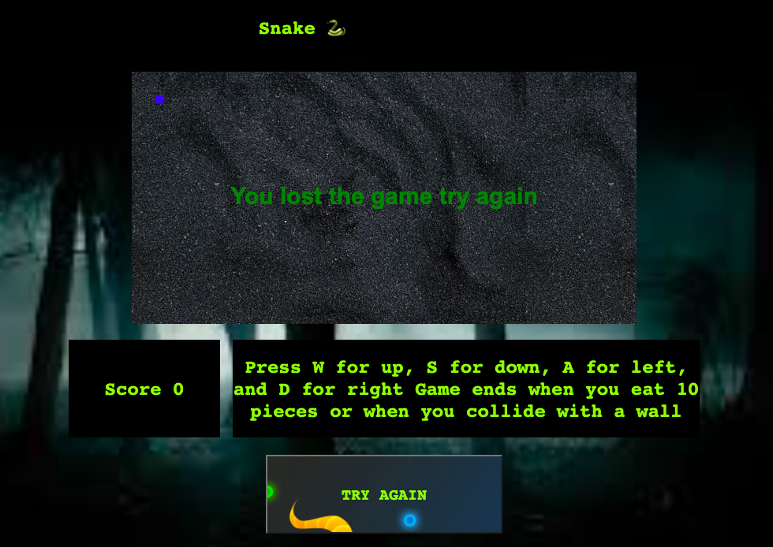

## Felix Muwanguzi

## Felix's Snake 🐍 game

If you'd like to contribute or codealong just  on my project just fork and clone. You cam make a pull request if you make any changes. https://github.com/fmuwanguzi/Snake-game

Link to play the game https://fmuwanguzi.github.io/

This was my first project trying to build out a game using HTML (canvas),css  and javascript. Motivation for trying to make this game wasn't just that it was my first project at general assembly bootcamp. I remember playing this  game on old nokia flip phones as a child. 

Goal of the game is to have a block generate, move using keys on keyboard. And eat other blocks kind of like pacman. Difficulty of the game increases becuase the first block grows in size and moves faster as the game continues.

Below is some of the code I used to create the game.

## LETS GO

This allowed me to achieve movement using my keyboard

```javascript
document.addEventListener('keyup', function(evt){
    
    if(evt.key === 'w'){
        snake.direction = 'down' 
    }else if(evt.key ==='a' ){
        snake.direction = 'left'
    
    }else if(evt.key === 's'){
        snake.direction = 'up'
    
    }else if(evt.key ==='d') {
        snake.direction = 'right'
        
    }
```

This allowed me to have an end of game message using an if statemtent and more importantantly collision detection between my block and the outside wall.

```javascript
function collisionWall(){
    if(snake.y > game.height){
        clearCanvas()
        gameOverMessage()
    
        
    }else if(snake.x < 0){
        
        clearCanvas()
        gameOverMessage()

        
    }else if(snake.x > game.width){
        
        clearCanvas()
        gameOverMessage()
        
    }else if(snake.y <0){
        
        clearCanvas()
        gameOverMessage()
        
}
}

function gameOver() {
    
    ctx.fillStyle = 'green';
    ctx.textBaseline = 'middle'; 
    ctx.textAlign = 'center'; 
    ctx.font = 'normal bold 30px arial';
    
    ctx.fillText('You lost',  game.width/2 , game.height/2);
}

```

## Getting through this blocker 🙌  :

After realizing I might have to start over if I use the same technique we used canvas crawler(making the block(that ate another block) .I decided to see if I could just relocate the blocks that snake needs to eat to grow

```javascript
function relocateBlock(){
    const minx = 0;
    const maxx = 400;
    const xvalue = Math.random() * (maxx - minx) + minx;

    const miny = 0;
    const maxy = 200;
    const yvalue = Math.random() * (maxy - miny) + miny;

    block1.x = xvalue;
    block1.y = yvalue;
}
```
This relocate function is now used every time the snake and block detect collisiton inside my eatingBlock function and the score changes as well.
And lastly to increase the size of the snake game incrimentally. 

This function also allows for the score to go up with each bite
```javascript
let score = 0;
function eatingBlock() {
     if (snake.x < block1.x + block1.width 
        && snake.x + snake.width > block1.x
        && snake.y < block1.y + block1.height
        && snake.y + snake.height > block1.y
        ){
           
            
        relocateBlock();
        score += 1;
        //This add 1 to the score as the player eats each block
        document.getElementById('score').innerHTML = 'Score ' + score
        snake.width += 5;
        snake.height += 5;
}
```

As part of the requirements for this project I created a reset button using an event listner.

```javascript

  //Reset the game
    document.getElementById("reset").addEventListener("click",function(){
        resetCanvas()
    });
    // clears the canvas when invoked
    function resetCanvas() {
    window.location.reload();
}
```
I used a set interval for my animations. The animations becomes incrementally faster after each block that gets consume by my snake(5+ score). This allows for the game to have increasing difficulty.

```javascript
    function rePaint(){
        
        ctx.clearRect(0, 0, game.width, game.height)
        
        if(snake.direction === 'left'){
            snake.x -=(5 + score)
        }else if(snake.direction === 'right'){
            snake.x +=(5 + score)
        }else if(snake.direction === 'up' ){
            snake.y +=(5 + score)
        }else if(snake.direction === 'down'){
            snake.y -=(5 + score)
        }
        
        
        
        snake.render()
        block1.render()

            winner()///sets winning condition to 10
            collisionWall()//set losing condition to collliding with wall
            eatingBlock()
           
        }
     const intervalID = setInterval(rePaint, 1000/20 ) 

```

I had an slight issue when I was testing the lose functions. I had not cleared the timer that allows for animation. And also using clearRect to remove any block left on the cavas.

```javascript
function clearCanvas(){
    ctx.clearRect(0,0, game.width, game.height)
    clearInterval(intervalID);
}
```

I also set up my winning conditions of eating at least 10 blocks and then displaying a message

```javascript
function gameWin() {
    
    ctx.fillStyle = 'green';
    ctx.textBaseline = 'middle'; 
    ctx.textAlign = 'center'; 
    ctx.font = 'normal bold 30px arial';
    
    ctx.fillText('You Win',  game.width/2 , game.height/2);
}
function winner(){
    if(score === 10){
       clearCanvas()
        gameWin()
                
        }
    }
```

Combination of all these moving parts allowed for this image below which shows that the user/player going out of bounds and losing after missing the block.
 


## Some additional goals

I would to add a start screen that the user would click to start the game.

I would like to make the block an image of a snake that shows the head of the snake turning and becoming larger.

And lastly I would want to raise the win condition to 50 and allow players to be able to input there names and save their scores.

